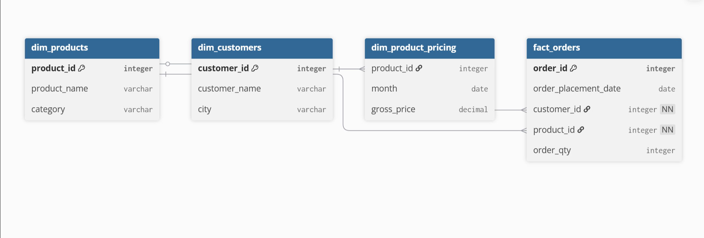
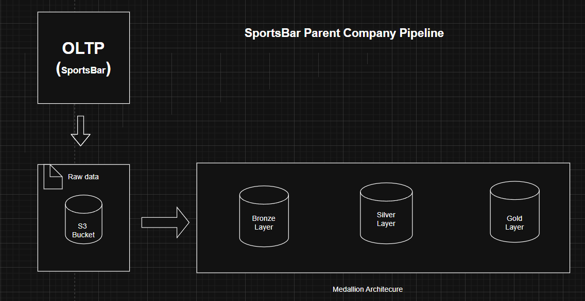

#  SportsBar Data Pipeline Architecture

## 📌 Project Overview

The **SportsBar Data Pipeline** is an enterprise-grade data engineering project designed to process and transform transactional sales data from child companies into analytics-ready datasets.

This platform implements a **Medallion Architecture (Bronze → Silver → Gold)** using Databricks and AWS to ensure scalable, reliable, and high-quality data processing.

---

## 🎯 Objective

Build a scalable and automated data platform that:

- Ingests multi-source CSV data from AWS S3  
- Cleans and transforms raw transactional data  
- Supports both **full historical loads** and **incremental daily loads**  
- Delivers analytics-ready datasets  
- Enables real-time insights into:
  - Sales performance
  - Customer behavior
  - Product trends

---

# 🏗 Architecture Overview



## 🔹 Technology Stack

| Layer | Technology |
|------|-------------|
| Storage | Amazon S3 |
| Processing | Apache Spark (PySpark) |
| Platform | Databricks |
|Language | Python |
| Query Engine | Spark SQL |
| Architecture | Medallion Architecture |
| Orchestration | Databricks Workflows |
| Dashboarding | Databricks SQL |

---

# 📊 Data Sources (Child Company CSV Schema)

### customers.csv                           
| field name| data type |           
|------|-------------|
| product_id | integer |
| product_name | string |
| category | string|

### products.csv
| field name| data type |           
|------|-------------|
| product_id |integer|
| month | string |
| gross_price | string|


---

# 🏛 Medallion Architecture Design

---

## 🥉 Bronze Layer — Raw Ingestion

**Purpose:** Store raw data exactly as received.

### Features

- Data ingested from AWS S3
- Stored in Delta format
- No transformations applied
- Append-only loads
- Schema enforcement enabled

### Audit Columns

- `ingestion_timestamp`
- `source_file_name`

---

## 🥈 Silver Layer — Cleaned & Transformed

**Purpose:** Data cleansing and standardization.

### Transformations Applied

- Data type casting
- Null handling
- Deduplication
- Data validation
- Column trimming
- Schema enforcement

### Output Tables

- `dim_customers`
- `dim_products`
- `dim_product_pricing`
- `fact_orders`

---

## 🥇 Gold Layer — Business Aggregations

**Purpose:** Analytics-ready datasets.

### Example Metrics

- Total revenue by month
- Sales by city
- Top selling products
- Customer lifetime value
- Category performance

Gold tables are optimized for BI dashboards and reporting.

---

# 🧠 Data Modeling (Star Schema)

## Fact Table

`fact_orders`

## Dimension Tables

- `dim_customers`
- `dim_products`
- `dim_product_pricing`
---

# 🔁 Data Loading Strategy

---

## 1️⃣ Full Load (Historical Processing)

Used During:

   - Initial pipeline setup

### Process Flow

1. Load full data from S3 → Bronze  
2. Transform Bronze → Silver  
3. Build Gold aggregations  

### Write Mode
```python
.mode("overwrite")
```

## 2️⃣ Incremental Load (Daily Processing)

Used For:

- Daily transaction ingestion
- End-of-day updates
- Continuous refresh

Strategy

- Append new records to Bronze
- Upsert into Silver (MERGE)
- Recompute affected Gold partitions

```python
.mode("append")
```

## 🎉 Conclusion

The SportsBar Data Pipeline demonstrates an end-to-end modern data engineering solution featuring:

- Cloud-native architecture
- Automated orchestration
- Incremental processing
- Scalable transformations
- Analytics-ready modeling

This project reflects production-grade implementation of Databricks + Spark + AWS S3 within a Medallion framework.
